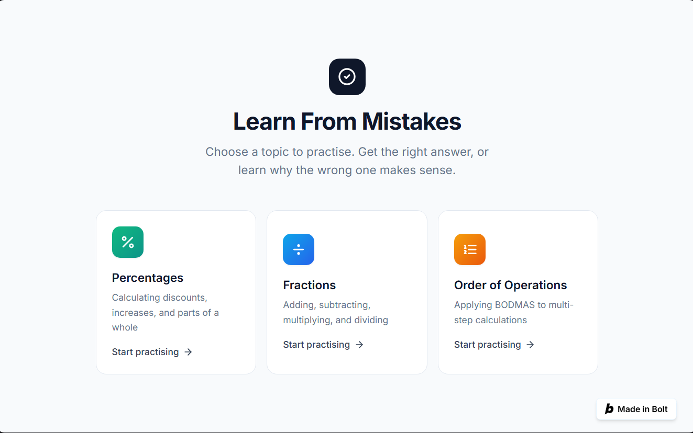
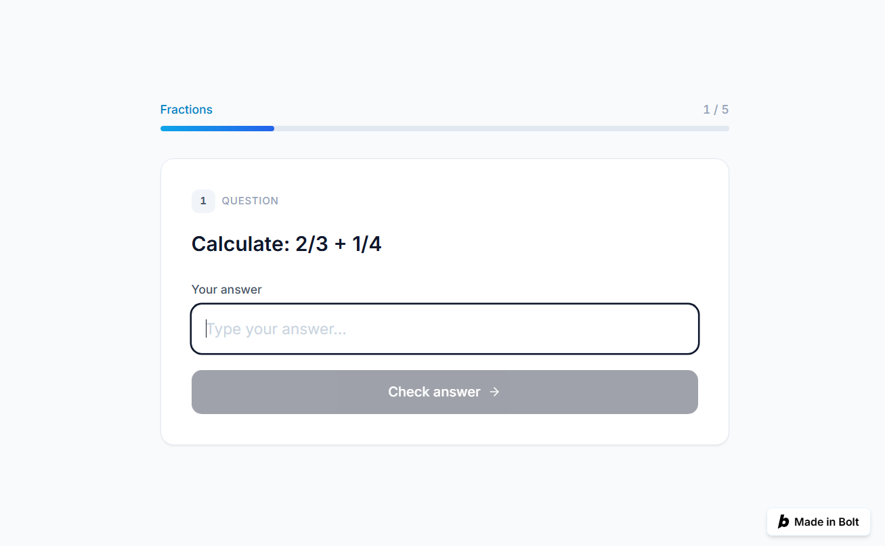

# Learn From Mistakes

> Understand *why* you were wrong — not just what the right answer is.

**Learn From Mistakes** is a learning app for students aged **12–14** who struggle with basic mathematics and often repeat the same types of mistakes. Instead of only telling a learner that an answer is wrong, the app asks **how they reached that answer**, identifies a likely misconception, explains the correct method, and gives a similar follow-up question to check whether the learner understood the feedback.

Built during **AI for Good — Hackathon 1** as a one-week prototype.

---

## Live demo

**Try the app:** https://learn-from-mistakes-4aet.bolt.host

The project in the Bolt editor: https://bolt.new/p/70633023

## Screenshots

| Topic selection | Question flow |
|---|---|
|  |  |

---

## What it does

Students can practise three topics:

- Percentages — discounts, increases and parts of a whole
- Fractions — adding, subtracting, multiplying and dividing
- Order of Operations — applying BODMAS to multi-step calculations

The learning flow is:

```
Question → Answer → Explain reasoning → Misconception feedback → Similar follow-up question → Progress
```

The app also tracks learning progress, common mistakes and corrected misconceptions, and gives a recommended next step. A parent view can show a student's learning summary without showing the student's private written reasoning. The prototype also includes a **My Data** page and a **Feedback / Report a Problem** option.

## Target group

Lower-secondary students aged 12–14 who need extra practice with basic maths and benefit from understanding *why* they make mistakes, not only seeing the correct answer.

## SDG 4 — Quality Education

The project supports **SDG 4: Quality Education** by providing personalised practice and feedback that helps learners understand and correct misconceptions. Progress is based on performance, including whether a learner can answer a similar question correctly after receiving feedback.

## How to run

**Try the app:** https://learn-from-mistakes-4aet.bolt.host

**View the source code:** https://bolt.new/p/70633023 — open the project and
switch to the **Code** tab to browse the files (`src/components`, `src/utils`,
`src/data`). The preview pane runs the app inside Bolt; there is no separate
local server to start.

**Built with:** Bolt.new, React, TypeScript, Vite and Tailwind CSS.

## Repository contents

| File | Description |
|---|---|
| [`README.md`](README.md) | This file |
| [`ETHICAL_REFLECTION.md`](ETHICAL_REFLECTION.md) | Ethical reflection on exclusion, assumptions, misuse and mitigations |
| [`Learn_From_Mistakes_Presentation.pptx`](Learn_From_Mistakes_Presentation.pptx) | The original slide deck |

---

Hackathon prototype: learning data is stored locally in the browser. The current misconception analysis uses predefined patterns and automated matching rather than sending student reasoning to an external AI model.
