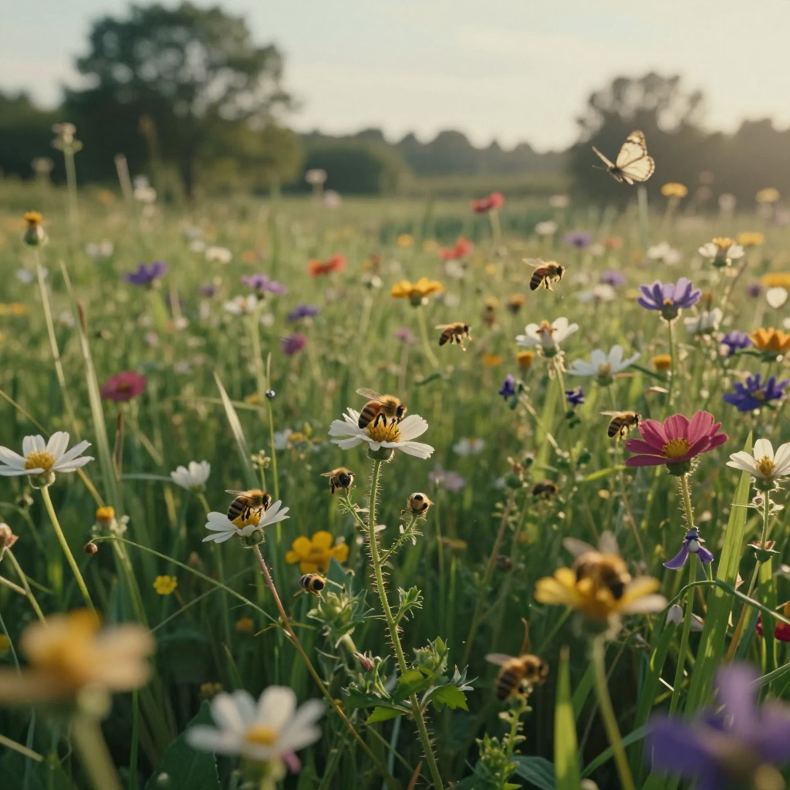
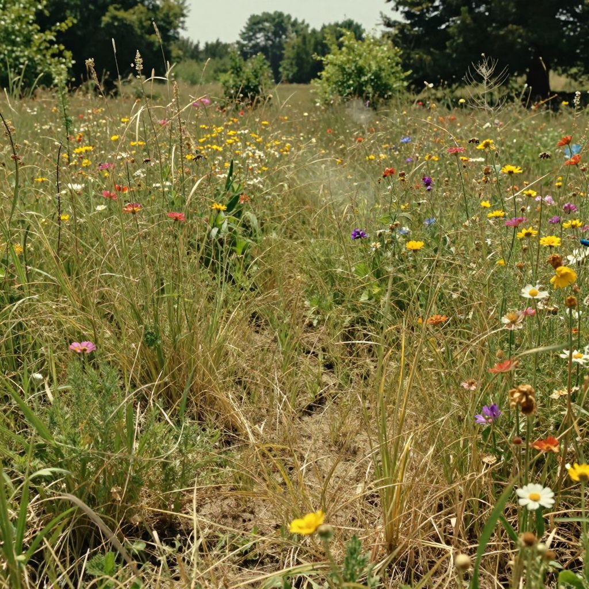
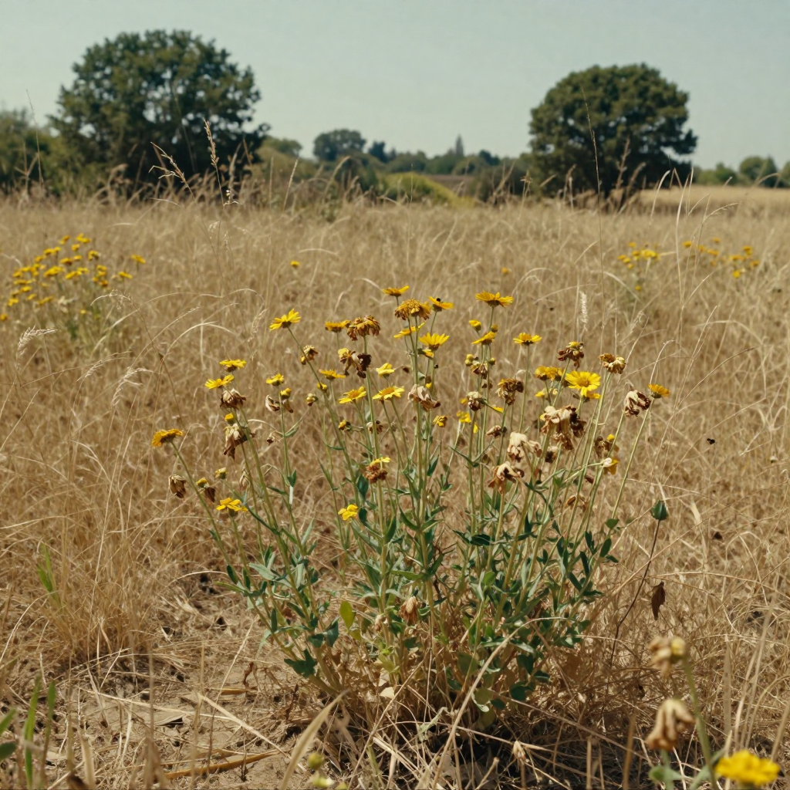
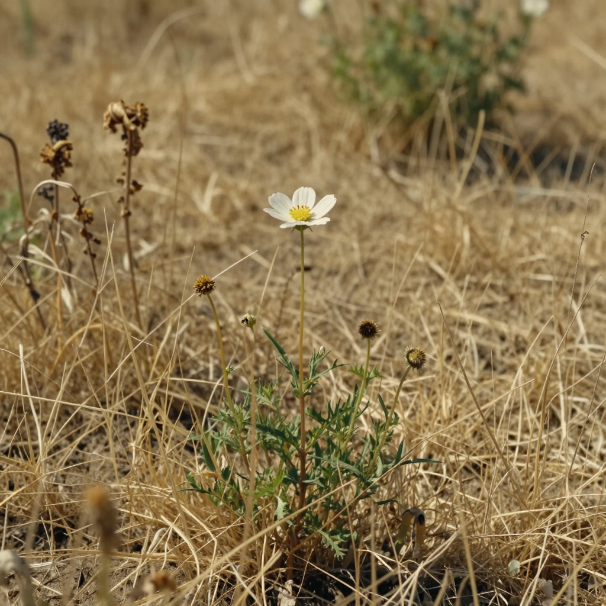
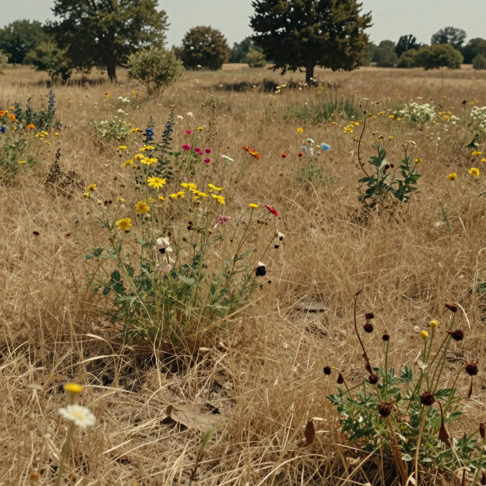
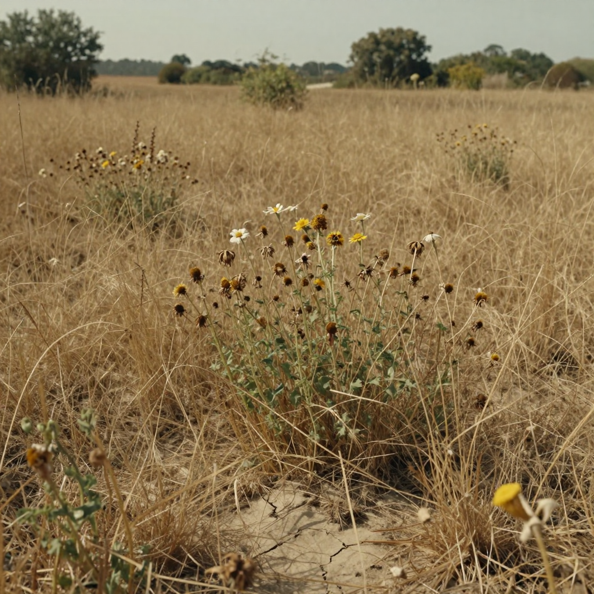
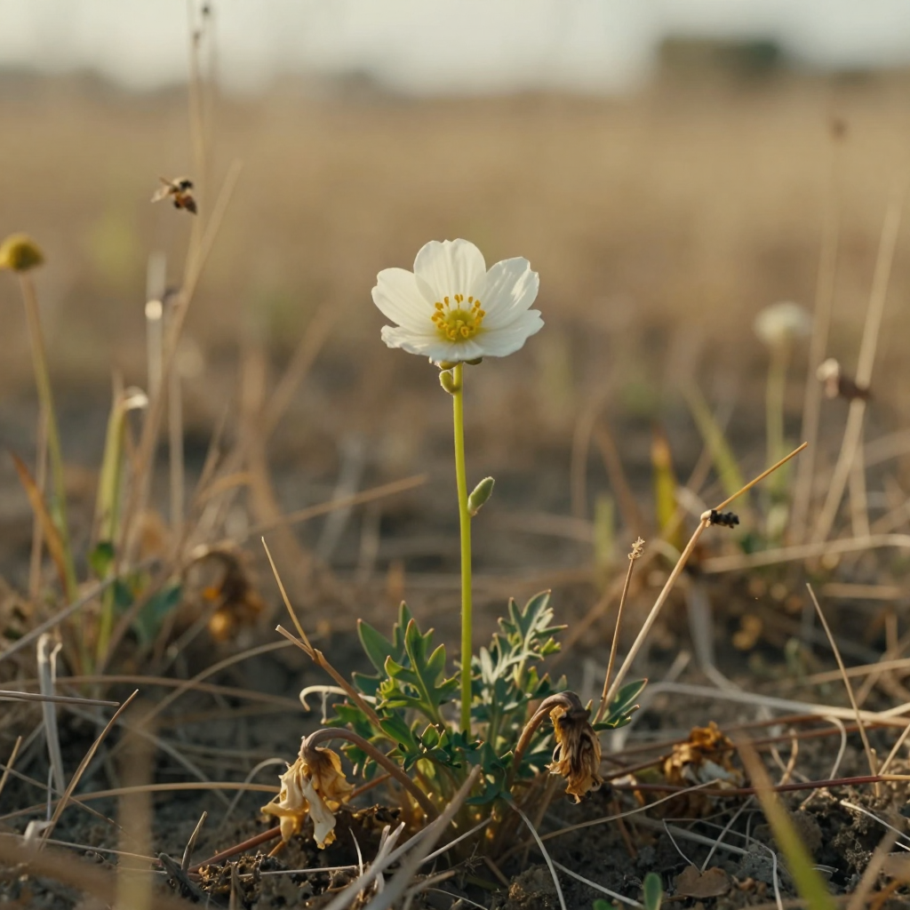
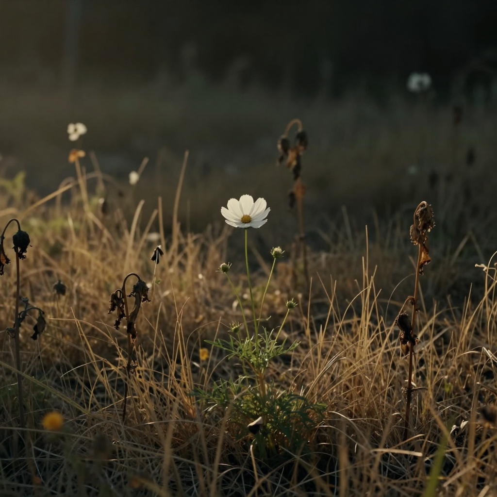
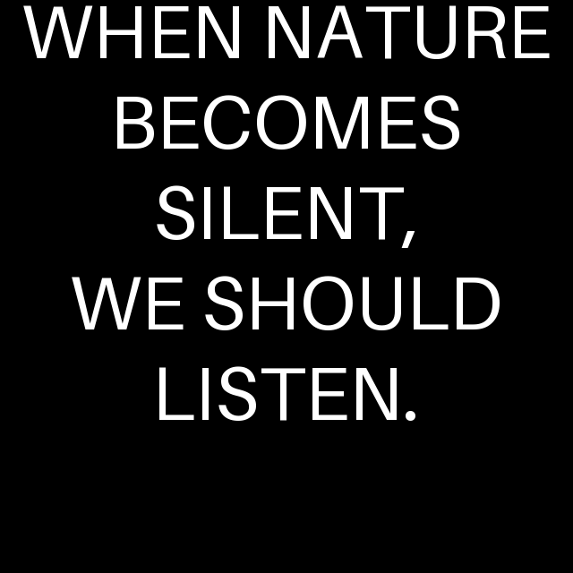

# Shot list / storyboard: The Silent Garden

9 shots, 33.6 seconds in total. Every shot starts as a still made with **Z-Image Turbo** and is animated with **Wan 2.2 image-to-video (14B, fp8)** in ComfyUI. The frame in each row is the still that the clip starts from (also in [`frames/`](frames/)).

**Settings shared by every shot**

- Stills: Z-Image Turbo bf16, 1024×1024, 9 steps, CFG 1.0, euler / simple, ModelSamplingAuraFlow shift 3
- Motion: Wan 2.2 I2V 14B fp8 (high + low noise), 640×640, 16 fps, 20 steps, CFG 3.5, switch to low-noise model at step 10, shift 5, 4-step LoRA **off**
- Clip length: 65 frames = 4.06 s (end card: 17 frames = 1.06 s)
- **Negative prompt (stills, same for shots 1–8):** `cartoon, illustration, anime, fantasy, surreal, artificial flowers, giant insects, deformed insects, extra wings, distorted plants, unrealistic colors, oversaturated, blurry, low quality, text, logo, watermark`
- **Negative prompt (motion):** the default Chinese negative prompt from the ComfyUI Wan 2.2 template (blurry, static, low quality, deformed, etc.), unchanged; see the video workflows.

| # | Time | Duration | Frame | What you see | Narration | Image prompt | Motion prompt | Seeds |
|---|---|---|---|---|---|---|---|---|
| 1 | 0:00.00–0:04.06 | 4.06 s |  | Wide, low shot of a lush wildflower meadow in soft morning light. Honeybees on the flowers, a butterfly in the air. This is the 'before' picture. | At first, everything was alive. | A wide cinematic establishing shot of a peaceful fictional wildflower garden on a warm summer morning, lush green grass and colorful wildflowers growing naturally across the garden, several clearly visible honeybees with at least three bees clearly recognizable in the foreground and middle ground, bees actively visiting flowers and collecting pollen, a few clearly visible butterflies gently flying above the flowers, healthy green plants, a few trees in the background, soft golden morning sunlight, gentle breeze moving the flowers and grass, natural imperfections, realistic botanical details, clear foreground middle ground and background depth, low camera position among the flowers, realistic natural environment, cinematic photography, photorealistic, natural colors, subtle depth of field, peaceful lively atmosphere, wide cinematic composition | Very slow cinematic forward camera push through the wildflower garden. Gentle natural breeze moves the flowers and grass softly. Several bees move naturally between the flowers, and a butterfly drifts slowly through the scene. Preserve the original garden composition, flowers, trees and lighting. Natural subtle motion only, realistic physics, photorealistic cinematic movement. No scene change, no new objects, no camera shake, no dramatic movement. | image `231907389660576` video `264244520398999` |
| 2 | 0:04.06–0:08.12 | 4.06 s |  | Same garden on a hot day. The grass starts to yellow, heat haze in the distance; bees and butterflies are still there but less active. | Flowers were blooming everywhere, and bees and butterflies filled the garden with life. | A wide cinematic establishing shot of the same fictional wildflower garden, later on a very hot summer day, the same garden layout and natural composition, lush green grass and colorful wildflowers still present but beginning to show mild heat stress, slightly drier and more yellowing grass, some flowers beginning to wilt, intense warm sunlight, subtle visible heat haze in the distance, dry soil appearing between some plants, a few healthy flowers remaining, several clearly visible honeybees and a few butterflies still present but less active, healthy trees in the background, gentle hot breeze moving the grass and flowers, realistic natural imperfections, realistic botanical details, clear foreground middle ground and background depth, low camera position among the flowers, realistic natural environment, cinematic photography, photorealistic, natural colors, gradual environmental change, wide cinematic composition | Very slow cinematic upward camera movement through the same wildflower garden. A gentle hot breeze moves the grass and flowers naturally. Subtle heat haze shimmers in the distance. The vegetation moves slightly slower and looks mildly stressed, while the remaining bees and butterflies move gently and less actively. Preserve the original garden composition, flowers, trees, lighting and colors. Natural subtle motion, realistic physics, photorealistic cinematic movement. No scene change, no new objects, no camera shake, no dramatic movement. | image `264055032053628` video `1067320647112606` |
| 3 | 0:08.12–0:12.19 | 4.06 s |  | Most of the grass is now dry and yellow. Only a few clumps of flowers are left and almost no insects. | Then... the heat came. | A wide cinematic establishing shot of the same fictional wildflower garden after a prolonged period of intense summer heat, the same natural garden environment and similar composition, noticeably drier and more yellowing grass, dry soil visible between plants, many wildflowers beginning to wilt and droop, several flowers losing their freshness, some leaves becoming dry and slightly brown, only a smaller number of healthy flowers remaining, strong harsh summer sunlight, subtle warm haze in the distance, a few plants showing clear heat stress, very few bees and butterflies still present, healthy trees remaining in the background, gentle dry breeze moving the grass and wilted flowers, realistic natural imperfections, realistic botanical details, clear foreground middle ground and background depth, low camera position among the flowers, realistic natural environment, cinematic photography, photorealistic, natural colors, gradual environmental change, wide cinematic composition | Slow cinematic horizontal camera movement across the same stressed wildflower garden. A dry breeze gently moves the yellowing grass and wilted flowers. Subtle heat shimmer is visible in the distance. A very small number of remaining bees move slowly and naturally among the few surviving flowers. Preserve the original garden composition, vegetation, trees, lighting and environmental progression. The garden should feel noticeably drier and more stressed than before. Natural subtle motion, realistic physics, photorealistic cinematic movement. No scene change, no new objects, no camera shake, no dramatic movement. | image `566428636173258` video `94980582580570` |
| 4 | 0:12.19–0:16.25 | 4.06 s |  | Close-up of one white flower standing in dry grass. No bees, no butterflies: the first moment the absence is really visible. | Slowly, the flowers began to disappear. | A cinematic close-up of a single wildflower in the same fictional garden after prolonged summer heat, the flower standing among dry yellowing grass and wilted plants, no bees visible anywhere, no butterflies visible anywhere, no insects visible, dry soil and stressed vegetation in the background, harsh warm sunlight, subtle heat haze, muted natural colors, the flower still partly healthy but surrounded by signs of environmental stress, realistic botanical details, shallow depth of field, realistic natural imperfections, cinematic photography, photorealistic, quiet and empty atmosphere, close camera position at flower height, gentle dry breeze, natural realistic environment | Very slow cinematic push-in toward the single wildflower. A gentle dry breeze moves the flower and surrounding yellow grass very subtly. The background remains quiet and still, with subtle heat haze in the distance. No bees, no butterflies and no visible insects appear at any point. Preserve the original flower, composition, lighting and dry environment. Shallow depth of field, realistic natural movement, photorealistic cinematic motion. No scene change, no new objects, no camera shake, no dramatic movement. | image `1102463728654430` video `753180266364089` |
| 5 | 0:16.25–0:20.31 | 4.06 s |  | Wide shot of the depleted garden. Few colours left, wilted plants, practically no pollinators. | And the bees stopped coming. | A wide cinematic view of the same fictional wildflower garden after prolonged extreme summer heat, the garden now noticeably changed and stressed, much of the grass dry and yellow, patches of dry soil visible, many wildflowers wilted or dried, fewer colorful flowers remaining, several plants with brown or curled leaves, almost no bees or butterflies visible, only a few small insects if any, trees still present in the background but surrounded by a dry landscape, strong late afternoon sunlight, subtle warm haze, muted natural colors, realistic environmental stress, natural imperfections, realistic botanical details, clear foreground middle ground and background depth, slow cinematic composition, realistic natural environment, cinematic photography, photorealistic, quiet atmosphere, wide composition | Slow cinematic sideways camera movement across the same stressed wildflower garden. Dry yellow grass and wilted flowers move gently in a warm, dry breeze. A few remaining plants move naturally, while the trees in the background remain stable. Almost no insects are visible. Subtle warm haze in the distance. Preserve the original garden composition, dry vegetation, trees, lighting and muted natural colors. The garden should feel noticeably quieter and more depleted than before. Natural subtle motion, realistic physics, photorealistic cinematic movement. No scene change, no new objects, no camera shake, no dramatic movement. | image `1070711228325951` video `505261841418875` |
| 6 | 0:20.31–0:24.38 | 4.06 s |  | Wide shot of a dry, almost motionless garden with cracked soil. No insects, no birds: the 'silent' garden. | The garden became quiet... and then, silent. | A wide cinematic shot of the same fictional wildflower garden after prolonged extreme summer heat, the garden now severely stressed and almost completely still, dry yellow and brown grass covering most of the ground, wilted and dried wildflowers scattered throughout the garden, patches of dry cracked soil visible, almost no healthy vegetation, no bees, no butterflies, no birds, no visible insects, trees remaining in the distant background, muted natural colors, soft dusty warm atmosphere, late afternoon light, very little wind, an unnatural sense of stillness, realistic environmental stress without apocalypse or destruction, realistic botanical details, natural imperfections, clear foreground middle ground and background depth, cinematic photography, photorealistic, quiet empty atmosphere, wide composition, subtle emotional mood | Very slow cinematic forward camera movement through the same severely stressed wildflower garden. Dry yellow and brown grass moves only slightly in a very weak breeze. Wilted flowers and dry plants remain almost completely still. The trees in the distant background remain stable. No bees, no butterflies, no birds and no visible insects. The garden feels empty and unnaturally quiet. Preserve the original composition, dry vegetation, trees, muted colors and late afternoon lighting. Very subtle natural motion, realistic physics, photorealistic cinematic movement. No scene change, no new objects, no camera shake, no dramatic movement. | image `513287932268419` video `734329452191837` |
| 7 | 0:24.38–0:28.44 | 4.06 s |  | Close-up of a single healthy white flower that survived. Hope, but alone. | *(silence)* | A cinematic close-up of one single healthy wildflower surviving alone in the same fictional garden, the flower fresh and vibrant with delicate petals and a healthy green stem, surrounded by dry yellow and brown grass, wilted flowers and stressed vegetation, patches of dry soil visible around it, no bees, no butterflies, no birds, no visible insects, the rest of the garden dry and silent in the background, soft late afternoon sunlight gently illuminating the surviving flower, subtle warm haze, a gentle breeze barely moving the flower, realistic botanical details, natural imperfections, shallow depth of field, cinematic photography, photorealistic, natural colors, peaceful but emotionally quiet atmosphere, symbolic feeling of resilience, close camera position at flower height | Very slow cinematic push-in toward the single healthy white wildflower surviving alone in the same stressed garden. A gentle breeze barely moves the flower and its green stem. The surrounding dry yellow and brown grass moves very subtly. Wilted plants in the background remain mostly still. No bees, no butterflies, no birds and no visible insects. Preserve the original flower, composition, lighting and dry environment. Soft late afternoon sunlight gently illuminates the surviving flower. Shallow depth of field, realistic botanical movement, photorealistic cinematic motion, peaceful and emotionally quiet atmosphere. No scene change, no new objects, no camera shake, no dramatic movement. | image `461442495174197` video `1071312855903262` |
| 8 | 0:28.44–0:32.50 | 4.06 s |  | Darker final image: the white flower on one side, dark empty space beside it, prepared for the closing message. | When nature becomes silent... we should listen. | A cinematic final frame of the same fictional garden at late afternoon, one single healthy white wildflower standing alone among dry yellow and brown grass and wilted plants, the surviving flower softly illuminated by gentle warm light, the rest of the garden fading into a quiet darker background, subtle atmospheric haze, strong visual contrast between the healthy flower and the damaged environment, realistic botanical details, natural imperfections, photorealistic cinematic photography, muted natural colors, shallow depth of field, emotional and contemplative atmosphere, the flower positioned slightly to the side with clear dark negative space beside it for a final message, minimal composition, peaceful stillness, no bees, no butterflies, no birds, no visible insects | Almost completely static cinematic final shot of the same fictional garden at late afternoon. One single healthy white wildflower remains standing among dry yellow and brown grass and wilted plants. A very gentle breeze causes only tiny natural movement in the flower and nearby grass. The background remains dark, quiet and still. No bees, no butterflies, no birds and no visible insects. Preserve the original composition, flower position, negative space, lighting and muted natural colors. Very subtle slow camera push-in, peaceful contemplative atmosphere, photorealistic cinematic movement. No scene change, no new objects, no camera shake, no dramatic movement. | image `930228622318225` video `436669391091680` |
| 9 | 0:32.50–0:33.56 | 1.06 s |  | Black end card with the white text 'WHEN NATURE BECOMES SILENT, WE SHOULD LISTEN.' (made with a TextOverlay node, then turned into a 1-second clip). | *(line ends, film ends)* | *(no diffusion prompt: EmptyImage 640×640 black + TextOverlay, font size 48, white, centered)* | DONT DO ANTTHING JUST KEEP THE SAME PIC FOR ! SECOND | video `923554944017395` |

The end-card motion prompt is copied exactly as we typed it. It was only meant to hold the image still for one second, and that is what it did.

**Workflow per shot:** `workflows/1_images/<shot>_image.json` makes the still, `workflows/2_video/<shot>_video.json` animates it. The seeds above are already filled in and set to *fixed*.